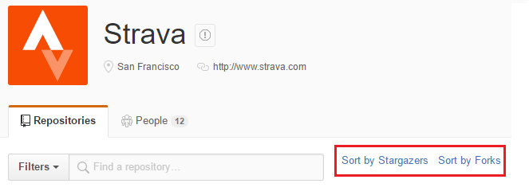
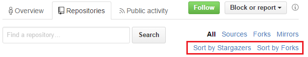

## Github Repository Sorter
A userscript to sort Github repositories. The script can be installed through [GreasyFork](https://greasyfork.org/en/scripts/20676-github-repository-sorter) or directly from [Github source](https://github.com/splttingatms/GithubRepoSorter).

### Organization Page

### Individual Page
